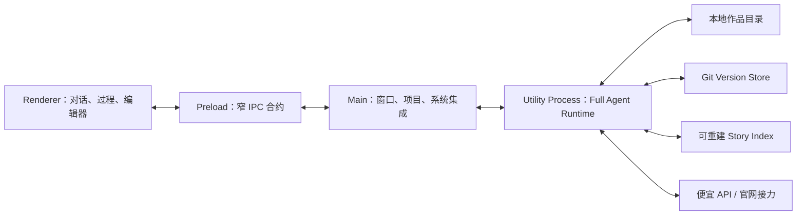

# LG Next 绿地架构

## 1. 架构目标

架构只抽象三件事：作品怎样保存、Agent 怎样行动、历史怎样被找回。它不抽象人物与作品最终意味着什么。

第一版是本机桌面应用，以后可以分发给其他用户在各自电脑上运行。当前不建设账户、云端和多人协作，但核心协议不与单一 UI 绑死。

## 2. 进程边界



- Renderer 不直接碰文件系统，只消费事件和发送用户意图。
- Main 负责窗口、目录选择、应用生命周期和启动 Agent 进程。
- Agent utility process 拥有完成任务所需的本机能力，长任务不会阻塞界面。
- Preload 只暴露明确 IPC 合约，不把 Node API 整体泄露给界面。

这是一条软件可靠性边界，不是面向用户的 Agent 权限系统。

## 3. 作品格式

一本书是一个可独立迁移的文件夹；Git 是按需启用的版本实现，不是作品格式的前提。

```text
我的小说/
  NOVEL.md                 # 小说工作区入口/清单，不是全文
  GUIDE.md                 # 可选的项目级工作约定
  章节正文/
    第一卷/
      第001章.md
  卷纲/
  章节大纲/
  人物设定/
  世界观/
  剧情管理/
    状态追踪/
    写作约束/
  inbox/
    external/              # 外部模型原文和来源
  .lg/
    project.json
    tasks/
    events/
    sessions/
    corrections.jsonl
    ledger.jsonl
    external/
    index/
    cache/
  .git/                    # 第一次版本化写入时按需创建
  .gitignore
```

根目录下的 Markdown 是用户可读、可脱离 LG 使用的项目文件。`NOVEL.md` 只描述作品身份、创作入口和少量项目清单；它不是把所有章节拼在一起的全文文件。章节正文以 `章节正文/` 下的文件为唯一正文来源，设定、大纲、剧情管理和约束是用户明确写下的项目材料，不能自动压缩成唯一人物真相。

上述目录均为按需目录，不要求新建空书时一次性生成。`.lg/` 是 LG 的运行时、可重建导航和本地项目记忆；删除 `.lg/index`、`.lg/cache` 或 `.lg/sessions` 不得损坏作品。当前实现中的 `BOOK.md`、`章节/`、`设定/`、`素材/` 只作为兼容别名处理，不作为新书的 canonical 格式。

应用启动先进入只读书架，不自动恢复并初始化最近作品。打开兼容的小说目录时先通过只读适配识别 Markdown 材料；`.lg/project.json`、任务、索引和 Git 分别在第一次真实对话、写入、检索或版本操作时产生。无法确认是小说的目录和非 Markdown 工程走显式导入 adapter，不冒充“打开一本书”。入口与格式演进的完整约束见 [书架、作品格式与长期可迁移性](./BOOK-LIFECYCLE-AND-MIGRATION.md)。

约束：

- 用户删除 `.lg/index` 和 `.lg/cache` 不会损坏作品；
- 正文与显式项目材料脱离 LG 仍可阅读；
- 任务会话属于本地作品记忆，但不冒充正文事实；
- 外部模型的原始回复可保存，是否进入作品由 Agent 判断；
- 被拒版本默认只存在于 Git 历史，用户可临时开放给 Agent 检索。

## 4. Full Agent Runtime

Agent 不接收固定工作流，只接收用户消息、当前任务和一组通用能力：

- 读取、搜索、写入和编辑文件；
- 执行本地命令；
- 查询 Git 历史与建立版本；
- 管理任务会话；
- 调用配置的模型 API；
- 编译官网接力材料并吸收粘回结果；
- 在用户明确要求时访问作品目录之外的本地材料。

Agent 自行决定读取摘要、片段还是完整原文，也可以扩大召回。系统记录它实际打开和使用过的来源，不固定上下文配方。

## 5. 工作区写入

所有写入必须经过一个 mutation service：

```text
用户编辑 / Agent / 外部结果
  -> 路径与并发校验
  -> 修改前快照
  -> 原子写入
  -> 内容 revision
  -> 索引失效事件
  -> 任务级 Git checkpoint
  -> 可验证结果事件
```

一次 Agent 任务可以写多个文件，但形成一个有意义的版本。Git 不参与每个按键和每次工具调用。

## 6. 检索与摘要

Story Index 是可重建导航，第一版优先透明和召回，不急于节省 Token。

索引可以保存：

- 路径、revision、标题、行号与文本片段；
- 名称、别名和共同出现位置；
- 章节顺序和 POV 出现位置；
- 带原文来源的简短导航摘要；
- 用户纠正与当时 revision 的联系。

索引不保存人物本质、关系阶段、主题解释、读者状态和预测答案。每次任务可以生成临时理解，任务结束后不必固化。

## 7. Git 版本层

定义 `VersionStore` 接口，Git 是第一实现：

- 任务开始前记录基线；
- 任务成功完成后创建语义 checkpoint；
- 无实际变化不 commit；
- 回滚与比较通过应用界面完成；
- 分支只用于用户真正希望同时保留的故事方向；
- 普通失败或拒绝版本进入隐藏历史；
- 索引与缓存加入 `.gitignore`。

未来多用户仍可为每个用户的每本书创建隔离仓库，不需要改变作品格式。

## 8. 事件流与 UI

Agent 向界面发送结构化事件：

```ts
type AgentEvent =
  | CommentaryEvent
  | ToolStartedEvent
  | ToolCompletedEvent
  | SourceOpenedEvent
  | MutationEvent
  | UsageEvent
  | FinalResultEvent
```

事件是事实记录，不是隐藏推理。任务可以关闭界面后继续运行，重新打开时从本地事件日志恢复。

## 9. 编辑器

第一版使用 Milkdown 构建小说模式，Markdown 是唯一持久格式。编辑器内部文档状态不能成为第二份作品真相；保存时必须稳定序列化回 Markdown，并通过 round-trip 测试保证不会无意改写全文。

源码模式后续使用 CodeMirror。两种模式不能同时独立保存，必须共享同一个文件 revision。

## 10. 当前暂不建设

- 云同步、账户和团队权限；
- 多 Agent 角色体系；
- 审美学习和灵性评估；
- 人物或关系状态机；
- 读者模拟；
- 自动浏览器操控官网模型；
- 复杂分支可视化；
- 提前模拟所有人物的后台人生。
