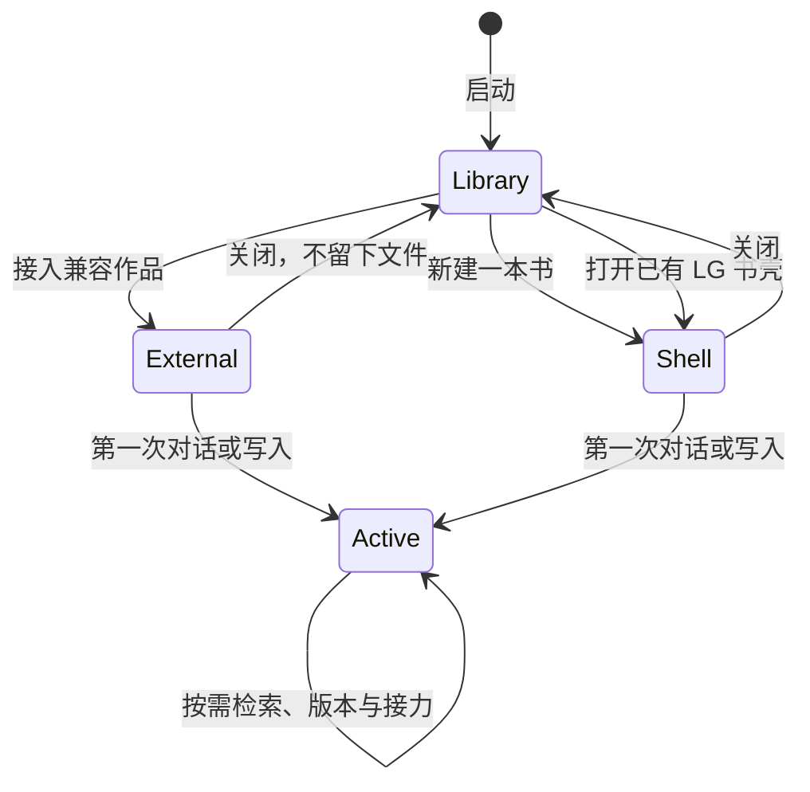

# LG Next 书架、作品格式与长期可迁移性

> 日期：2026-07-18
>
> 状态：入口与格式基线
>
> 目标：减少“还没有进入一本书”时的摩擦，并让一本书在未来版本、其他工具和不同存储实现之间仍然容易搬走。

## 1. 结论

入口不是一个空对话框，也不是运行时初始化页，而是一张安静的本地书架。

```text
启动 LG
  -> 只读书架
  -> 新建最小书壳 / 识别已有作品 / 继续最近作品
  -> 进入书
  -> 第一次真实动作才创建对应运行时能力
```

作品格式遵守一个更长期的边界：

```text
可读作品文件 = 本体，可脱离 LG 存在
.lg/            = 本地运行时与适配信息，可以重建或舍弃
```

这里的“迁移”不是为某个旧产品写一次性搬家脚本。它包括：移动同一本书、复制为新分支、未来 LG 格式升级、接入其他 Markdown 工具，以及从未知来源导入。

## 2. 当前入口为什么有摩擦

旧入口把“选择目录”直接等同于 `ProjectRuntime.initialize()`，一次完成：

- 建立章节、设定和素材空目录；
- 写入入口文件和隐藏元数据；
- 创建默认任务；
- 初始化 Git 并提交；
- 全量生成 Story Index。

这让三个意图混在一起：

1. 我只是想看看这是不是那本书；
2. 我想新建一本书，但还没决定从大纲还是正文开始；
3. 我已经要让 Agent 工作。

新的边界是：打开只表示“把这个文件夹作为当前作品阅读”。它不授权 LG 改造目录。写入、对话、检索和版本分别在用户第一次真正使用时激活。

## 3. 生命周期



### 3.1 Library：只读书架

启动只读取应用级的最近路径列表，不自动恢复最近作品，不创建任何书内对象。

书架只有两个主要动作：

- **新建一本书**：输入暂定书名，再选择父目录；
- **打开一本书**：选择已有作品目录；LG 在内部识别格式与材料角色。

最近作品直接显示在同一页，点击一次进入。模型配置不是进入书的前置条件；它只影响能否发送 Agent 消息。

### 3.2 External：未接管的兼容作品

“打开一本书”不是“任何文件夹都算一本书”。内部探测分三层：

- 含 `NOVEL.md` 格式标记的 LG 作品：直接识别；
- 由 Markdown 正文、大纲或设定组成的小说目录：通过只读兼容适配识别材料角色；
- Word、PDF、Scrivener 工程或无法确认用途的普通资料目录：不走“打开”，需要明确的导入 adapter。

兼容作品在打开阶段：

- 不写 `.lg/`；
- 不补 `NOVEL.md`；
- 不写 `.gitignore`；
- 不创建任务、索引或 Git；
- 使用路径哈希作为仅限本次应用识别的临时 ID。

第一次对话或正式写入时，LG 才补充最小 `.lg/project.json`，并把来源记为 `folder`。原有内容和目录名保持不变。

### 3.3 Shell：最小书壳

新书只创建：

```text
我的书/
  NOVEL.md
  .gitignore
  .lg/
    project.json
```

它不预建章节、人物、世界观、任务、事件、索引、缓存或 Git。作者先说一句话、先写第一章、先做大纲都可以，所需目录在第一次写入时自然产生。

### 3.4 Active：按能力懒激活

| 能力 | 首次触发 | 新增内容 |
| --- | --- | --- |
| 对话任务 | 发送第一条消息 | `.lg/tasks/`、`.lg/events/`、`.lg/sessions/` |
| 项目写入 | 编辑器、Agent 或外部结果首次写入 | ledger 与对应作品目录 |
| Story Index | Agent 搜索、用户检索或 Markdown 变更 | `.lg/index/` |
| 版本 | 第一次产生正文变更或打开版本历史 | `.git/` 与 checkpoint |
| 官网接力 | 第一次生成或回收接力包 | `.lg/external/` |

读取型 `list()` 不得通过 `mkdir` 改变磁盘。`load()`、`activate()`、`ensure*()` 的边界要能由测试观察。

## 4. 作品目录

参考 Living History 架构，目录只表达材料角色，不表达人物真相，也不要求作者维护数据库。

```text
我的书/
  NOVEL.md                    # 可移植入口与身份，不是全文
  GUIDE.md                    # 可选，人写下的项目工作约定
  章节正文/
    第一卷/
      第001章.md
  卷纲/
  章节大纲/
  人物设定/
  世界观/
  剧情管理/
    状态追踪/
    写作约束/
  inbox/
    external/
  .lg/
    project.json
    tasks/
    events/
    sessions/
    corrections.jsonl
    ledger.jsonl
    external/
    index/
    cache/
```

除 `NOVEL.md` 外，所有目录按需产生。已有作品使用 `章节/`、`正文/`、`设定/` 或自己的目录名时继续可用；索引通过角色识别兼容它们，不强制重命名。

### 4.1 `NOVEL.md`

`NOVEL.md` 是最小、自描述、普通工具也能打开的入口：

```markdown
---
format: lg-novel
formatVersion: 1
title: "我的书"
---

# 我的书
```

它不拼接全文，不复制人物卡，不保存索引结果，也不承担 Agent session。未来可以添加可选字段，但旧读取器遇到未知字段必须忽略。

### 4.2 权威层与派生层

| 层 | 内容 | 搬走时是否必需 |
| --- | --- | --- |
| 作品本体 | 正文、大纲、设定、世界观、作者约束、`NOVEL.md` | 必需 |
| 项目证据 | 用户纠正、外部模型原文、mutation ledger | 建议保留 |
| 工作连续性 | 任务、可见事件、session | 可选 |
| 可重建导航 | index、cache、临时观察 | 不必保留 |
| 版本实现 | `.git/` | 可选，作品不能依赖它才能读取 |

索引或摘要只能指向本体；不能通过迁移把派生解释升级成正文事实。

### 4.3 `.lg/project.json`

当前元数据版本为 2：

```json
{
  "version": 2,
  "format": "lg-novel",
  "id": "uuid",
  "title": "我的书",
  "createdAt": "2026-07-18T00:00:00.000Z",
  "updatedAt": "2026-07-18T00:00:00.000Z",
  "lifecycle": "shell",
  "origin": { "kind": "new" }
}
```

`project.json` 服务本地运行时；`NOVEL.md` 服务作品可读性和格式探测。两者标题冲突时不能静默互相覆盖，应提示用户选择。

## 5. 长期可迁移性

### 5.1 不把路径、数据库或 UI 当成作品身份

- 作品 ID 使用随机稳定 ID，不从绝对路径生成；
- 移动同一本书保留 ID；
- “复制为新书/故事分支”生成新 ID，并可记录 `derivedFrom`；
- 导入未知来源默认生成新 ID，只在报告中保存来源指纹；
- UI Thread ID、Agent session ID、Git commit 都不能替代作品 ID。

未接管的普通文件夹可以暂用路径哈希，但第一次激活必须换成随机持久 ID。

### 5.2 格式演进只做小步、显式、可恢复的迁移

格式有三套独立版本，不能共用一个大版本号：

1. `NOVEL.md.formatVersion`：可移植作品约定；
2. `.lg/project.json.version`：项目元数据；
3. index/session/ledger 各自的 schema version：运行时实现。

运行时 schema 可以直接重建；作品 schema 的升级必须：

```text
只读探测
  -> 生成迁移计划
  -> 备份受影响的小文件
  -> 写入临时文件
  -> 校验
  -> 原子替换
  -> 保存迁移报告
```

任何升级都不得批量改写正文来满足新模型。新版本需要新语义时，应添加可选文件或 adapter，而不是让历史作品服从新的内部结构。

### 5.3 导入使用 adapter，不使用来源特例污染核心

未来接入 Scrivener、Obsidian、纯文本仓库或其他小说工具时，每个 adapter 只负责：

```ts
interface BookImportAdapter {
  detect(sourcePath: string): Promise<Detection>
  plan(sourcePath: string): Promise<ImportPlan>
  materialize(plan: ImportPlan, stagingPath: string): Promise<ImportReport>
  verify(report: ImportReport): Promise<Verification>
}
```

统一核心只认识 `ImportPlan`，不认识某个历史产品的目录细节。归类必须确定性、可预览；无法识别的文件原样进入 `inbox/imported/`，不丢弃也不让模型猜。

### 5.4 三种操作必须分开

| 操作 | 作品 ID | 源目录 | 默认策略 |
| --- | --- | --- | --- |
| 移动/换机器继续 | 保留 | 用户自行复制或由工具移动 | 校验后继续打开 |
| 复制为新书/分支 | 新建 | 不改 | staging 复制，记录来源 |
| 从外部格式导入 | 新建 | 不改 | adapter 生成计划后复制 |

“打开文件夹”永远不是隐式导入。“导入”也不能原地改造来源。

### 5.5 离开 LG 也应简单

最小导出就是复制作品文件夹并排除：

```text
.lg/index/
.lg/cache/
.lg/sessions/    # 用户不需要对话连续性时
.git/            # 用户不需要版本历史时
```

正文、大纲和设定仍是 Markdown。即使没有 LG，`NOVEL.md` 也能告诉下一个工具这是什么，而不要求它理解本地 session、索引或 ledger。

## 6. API 与代码边界

主进程提供窄操作：

```ts
openProject(): Promise<OpenedProject | null>       // 选择并只读加载
createProject(title: string): Promise<OpenedProject | null>
openRecentProject(path: string): Promise<OpenedProject>
```

核心边界：

- `book-discovery.ts`：只读探测，不能调用任何 ensure；
- `book-format.ts`：格式 schema、最小书壳和元数据读写；
- `project-runtime.ts`：`load` 与懒激活 facade；
- `TaskStore.list()` 等读取接口：目录不存在时返回空，不创建目录；
- Renderer：只表达用户意图，不直接操作路径。

未来增加 `inspectProject()` 和 import adapter 时，仍保持探测与写入分离。

## 7. 当前实现基线

已完成：

- 启动进入书架，不自动恢复最近作品；
- 新建与打开分开；
- 最近作品在入口直接可达；
- 新书只创建最小书壳；
- 兼容作品打开时字节不变；
- 打开阶段的 Markdown 清单只扫描一次，并随 `OpenedProject` 交给界面；
- 第一句话自动创建第一个任务；
- 新章节使用 `章节正文/`，旧 `章节/` 继续兼容；
- Story Index 识别 `章节正文/` 和 `章节大纲/`；
- `TaskStore.list()` 读取不建目录。

后续切片：

1. 为普通文件夹增加只读探测摘要，但不增加强制确认步骤；
2. 为超大目录增加可取消扫描和应用级清单缓存，仍不写作品目录；
3. 增加“复制为新书”和通用 `ImportPlan`；
4. 增加可选择包含纠正、对话和 Git 的便携导出；
5. 为 `NOVEL.md` 与 `project.json` 冲突提供显式修复 UI。

## 8. 验收标准

- 冷启动只读取应用级书架，不触碰任何作品目录；
- 点击最近作品一次进入，不先经过任务或模型设置；
- 选择普通目录后打开再关闭，目录清单和文件 hash 不变；
- 新建书后不存在空章节目录、默认任务、Story Index 或 `.git/`；
- 新书可以先聊天，也可以先手写第一章；
- 第一次聊天只激活对话所需目录；
- 第一次正文写入才产生对应正文目录、ledger、索引与版本；
- 删除 index/cache/session 不影响正文和显式项目材料；
- 复制作品本体到没有 LG 的环境仍能直接阅读；
- 未来 schema 升级不批量重写正文，也不把派生人物解释写回作品。

## 9. 一句话设计

> 入口先让作者看见自己的书，而不是看见 LG 的运行时；格式先保证书能离开 LG 继续存在，再考虑 LG 如何更聪明地住进去。
