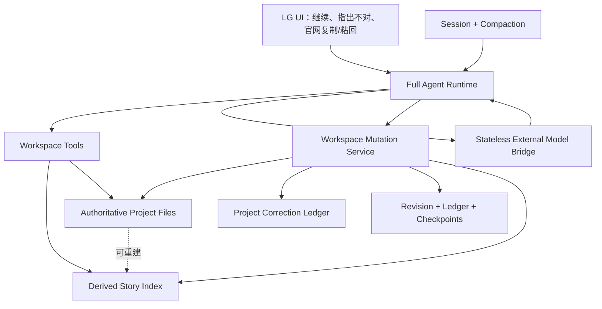
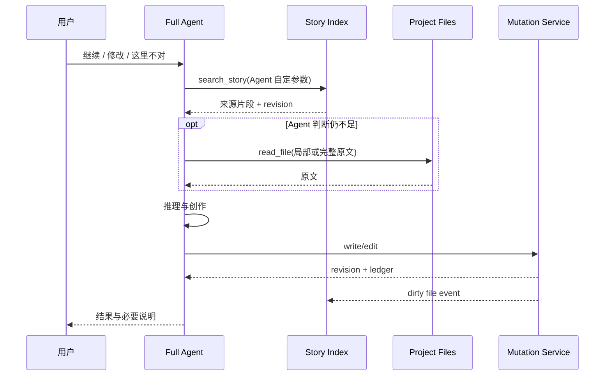

# LG Living History Agent 目标架构

> 日期：2026-07-18
>
> 状态：目标架构，可据此重构
>
> 上位原则见：[AI 小说创作算法与世界引擎优化方案](./ai-novel-world-creation-algorithm-optimization-2026-07.md)

## 1. 架构结论

LG 不建设“灵性引擎”、人物模拟器或关系状态机。目标系统由一个拥有完整工作区权限的主 Agent 驱动，其他组件只提供可靠的文件、记忆导航、版本、成本和外部模型接力能力。

正文与用户明确写入的项目文件是本体。索引、摘要、人物视图和关系视图都是可重建导航，不得成为人物真相。

目标数据流只有一条：

```text
用户请求
  -> Full Agent 自主判断
  -> 搜索本地导航 / 按需追到原文
  -> 本地模型执行，或编译一次性官网材料
  -> 直接写入工作区
  -> 统一 mutation 记录 revision、ledger、dirty state
  -> 增量更新派生索引
```

### 1.1 七项架构决策

1. **一个主 Agent。** 不按创作概念拆分多个 Engine。
2. **文件是权威。** 派生索引可以全部删除并重建。
3. **检索不自动注入。** Agent 通过工具主动搜索，并自行决定是否深入。
4. **写入只有一条通道。** Web 编辑、Agent 工具和外部结果回收共用同一 mutation service。
5. **作品记忆只在本地。** 官网模型按次使用，不承担持久记忆。
6. **纠正保存原话。** 不从微改或反馈推导用户审美画像。
7. **预算是软约束。** 有新证据时允许继续，无进展时提前停止，硬上限只负责成本保护。

---

## 2. 组件图



边界很重要：

- Agent 决定创作与检索策略；
- Mutation Service 保证写入一致性；
- Story Index 只帮助找到来源；
- Session 只保持当前对话连续性；
- Correction Ledger 属于项目记忆，不属于用户画像；
- External Bridge 不保存作品状态。

---

## 3. 权威数据与派生数据

### 3.1 权威数据

以下内容可以改变作品，必须版本化：

```text
章节正文/
卷纲/
章节大纲/
人物设定/
世界观/
剧情管理/
  状态追踪/
  写作约束/
NOVEL.md
GUIDE.md
.novel-guide/corrections.jsonl
inbox/external/     # 外部原始回复与来源
ledger.jsonl
```

人物设定仍可存在，但它只是作者明确写下的项目材料，不自动等于人物全部事实。若正文与人物卡产生新的张力，Agent 应读取来源并判断，而不是机械服从标签。

### 3.2 派生数据

```text
.novel-guide/index/
  manifest.json
  files.json
  spans/
  terms/
  mentions/
  cooccurrence/

.novel-guide/cache/
  observations/
  searches/
  handoff/

.novel-guide/sessions/
```

派生数据满足三个条件：

- 每条记录带来源路径和 source revision；
- 来源变化后可以判断 stale；
- 删除整个目录不会损坏作品，只会降低下一次检索性能。

### 3.3 不保存的内容

- 唯一、永久的“人物本质”；
- 关系好感度或灵魂状态；
- 系统猜测的用户审美；
- LLM 对某一段是否有灵性的评分；
- 官网模型隐式记住但本地没有的内容；
- 将一次人物行为推广为未来固定规则的自动结论。
- 读者知识、读者感受或作品意义状态。

---

## 4. 统一写入架构

当前实现存在两条主要写入链：

- Web `book-store`：写文件、更新 `book-index`、追加 ledger；
- Agent `write_file/edit_file`：直接操作工作区，并通过 tool metadata 返回变更。

这会造成索引、dirty state、ledger 和 revision 语义分叉。目标架构必须合并。

### 4.1 Workspace Mutation Service

建议在 `packages/novel-guide` 建立通用服务：

```ts
interface WorkspaceMutation {
  path: string
  operation: "create" | "replace" | "edit" | "delete"
  beforeRevision?: string
  afterContent?: string
  actor: "user" | "agent" | "external-import" | "system"
  reason?: string
  sourceTurnId?: string
}

interface MutationResult {
  path: string
  beforeRevision?: string
  afterRevision?: string
  changed: boolean
  ledgerId?: string
}
```

所有写入统一经过：

```text
校验路径与 outline 约束
  -> 读取 before snapshot 与 revision
  -> 原子写入临时文件并 rename
  -> 追加 ledger / checkpoint
  -> 标记索引 dirty
  -> 返回 MutationResult
  -> 后台增量索引
```

Web API 通过 adapter 调用该服务；Agent 文件工具也调用同一服务。`book-store` 不再自行实现另一套写入语义。

### 4.2 Revision

文件 revision 使用内容 hash，而不是只依赖 mtime：

```text
revision = sha256(normalized UTF-8 content)
```

mtime 只用于快速判断“可能没变”；真正引用和 stale 检查使用 hash。

### 4.3 一致性策略

- 正文写入同步完成；
- ledger 与 dirty 标记必须同步成功；
- 派生索引允许短暂最终一致；
- 搜索命中 stale shard 时执行 read-repair；
- 索引失败不能回滚正文，但要记录健康状态并允许重建。

---

## 5. Story Index：导航，不解释

### 5.1 统一现有两套检索

当前：

- `packages/novel-guide/src/tools/search.ts` 的 `search_canon` 会在每次调用时扫描文件并切段；
- `apps/lg/lib/server/book-index.ts` 已维护文件、章节、设定卡和 term index；
- `apps/lg/lib/server/retrieval.ts` 在 Web 层另做 file-level top-5 检索；
- Web retrieval 并不是主 Agent 的统一检索工具。

目标：把索引和搜索核心下沉到 `packages/novel-guide/src/story-index/`，CLI 与 Web 共用。`search_canon` 保留为兼容别名，最终由 `search_story` 取代。

### 5.2 最小索引模型

```ts
interface IndexedFile {
  path: string
  revision: string
  kind: "chapter" | "outline" | "setting" | "state" | "constraint" | "other"
  title?: string
  sequence?: number
  indexedAt: string
}

interface StorySpan {
  id: string
  path: string
  revision: string
  startLine: number
  endLine: number
  heading?: string
  text: string
  terms: string[]
  mentions: string[]
}

interface StoryHit {
  spanId: string
  path: string
  revision: string
  lines: { start: number; end: number }
  excerpt: string
  score: number
  reasons: string[]
  stale: boolean
}
```

`mentions` 只表示文本中出现了某个名字、别名或短语，不表示人物关系、情绪或动机。

### 5.3 检索接口

只增加一个主工具，避免把检索策略拆成许多业务工具：

```ts
interface SearchStoryInput {
  query?: string
  entities?: string[]
  pathGlob?: string
  kinds?: IndexedFile["kind"][]
  beforeSequence?: number
  afterSequence?: number
  detail?: "paths" | "snippets"
  limit?: number
  cursor?: string
}
```

工具返回来源、短片段、revision 和评分原因。Agent 再自行调用现有 `read_file` 读取局部或全文。

不提供 `get_character_truth`、`predict_character_action` 或 `find_spiritual_scene`。

### 5.4 检索策略

第一阶段使用确定性混合检索：

- 文件名、标题、别名精确命中；
- 中文二/三元词与完整短语；
- 同段或同场景实体共现；
- 章节顺序和当前场景邻近；
- 用户明确纠正的目标引用；
- Agent 指定的 path/kind/time filters。

评分只负责把可能相关的来源排到前面，不判断人物意义。

Embedding 不是第一阶段依赖。等真实长篇 eval 证明词法与共现召回不足，再作为可选 candidate generator；最终仍返回原文来源，不把向量相似度自动注入 Prompt。

### 5.5 增量与性能

现有 `book-index` 在单文件更新后可能重建完整 term index，长篇下会退化为 O(全书)。目标为：

- 按文件 revision 生成独立 span shard；
- 文件改变只重建该文件 shard；
- inverted postings 按 term 增量替换该文件的 posting；
- manifest 记录 index schema version；
- 进程内 LRU 缓存热 shard；
- 后台可全量 rebuild，线上搜索不等待全书重扫。

初期继续使用 JSON/JSONL，避免引入原生数据库依赖。达到规模瓶颈后，通过 `StoryIndexStore` 接口切换 SQLite FTS，不改变 Agent 工具协议。

---

## 6. Agent Runtime

### 6.1 Prompt 边界

稳定 system prompt 只保留：

- Full 权限与可回滚直接执行；
- 文件是项目依据；
- 派生摘要可疑，必要时追原文；
- 不把人物总结当行为答案；
- 用户明确纠正优先；
- 结果优先、如实报告。

目录、检索结果、人物材料和写作约束由 Agent 通过工具按需取得，不永久堆进 system prompt。

### 6.2 自主检索循环



产品不规定搜索次数和原文比例。它只给 Agent 当前成本、剩余上下文和每轮是否获得新证据。

当任务只是“继续”时，运行时不把它收窄为“紧接当前段落”。主 Agent 可以沿写、切换视角、跨越时间、暂离主线或写一个没有明显情节推进的章节，并直接落入正式正文。未采用的未来默认不进入持久项目状态。

写后复查允许检查前文遗漏、明显失真和解释过度，但不是固定的全文重写阶段。无法解释其功能的段落不因此被自动删除或润色。

### 6.3 自适应循环预算

```ts
interface LoopBudget {
  softLoops: number
  hardLoops: number
  noProgressLimit: number
  tokenBudget: number
  costBudget?: number
}
```

继续条件：本轮获得新来源、新 revision、有效写入或新的明确结论。

停止条件：

- 完成目标；
- 连续若干轮没有新进展；
- 达到硬 Token/成本上限；
- Agent 明确需要用户提供项目中不存在的信息。

固定 workflow 只给初始软预算，不决定 Agent 能否深入历史。

### 6.4 子 Agent

主 Agent 始终 full。子 Agent 仅用于并行的只读、可验证工作，例如连续性扫描和索引诊断。

子 Agent 不负责：

- 给文学价值打分；
- 决定人物下一步；
- 汇总出唯一人物真相；
- 覆盖主 Agent 已读到的原文。

---

## 7. Correction Ledger

用户指出“不对”是本作品内的高价值证据，应跨线程保留，但不能变成审美画像。

```ts
interface ProjectCorrection {
  id: string
  createdAt: string
  userText: string
  sourceTurnId: string
  targets: Array<{
    path: string
    revision: string
    startLine?: number
    endLine?: number
  }>
  scopeHints?: {
    characters?: string[]
    relationships?: string[][]
    chapters?: string[]
  }
  resolution?: {
    ledgerIds: string[]
    note?: string
  }
  status: "active" | "resolved" | "superseded"
}
```

只有 `userText`、目标引用和实际修订是权威的；`scopeHints` 是可重算导航。

记录方式：主 Agent 判断用户给出了明确项目纠正时，调用 `record_correction`。这是结构化 append 工具，不触发权限确认，也不推导规则。

检索方式：`search_story` 可以返回相关 correction 引用；是否读取完整原话由 Agent 决定。

---

## 8. External Model Bridge

### 8.1 本地权威

官网 ChatGPT、Gemini 或其他模型均视为无状态执行器。即使使用长期对话，本地也不假设它记得任何事实。

### 8.2 Agent-selected Handoff

现有固定六卡可以作为展示模板，但不能决定材料选择。目标接口：

```ts
interface ExternalTaskPackage {
  taskId: string
  createdAt: string
  projectRevision: string
  targetProfile: string
  instruction: string
  sources: Array<{
    path: string
    revision: string
    mode: "summary" | "excerpt" | "full"
    content: string
  }>
  constraints: string[]
  unresolved: string[]
  budget: { estimatedTokens: number; hardLimit?: number }
}
```

`sources` 完全由主 Agent选择。系统负责去重、Token 估算、manifest、复制和 zip。

### 8.3 回收

粘回官网结果后：

```text
保存 inbox/external 原文
  -> 绑定 taskId 与 package revision
  -> 主 Agent 判断结果类型和是否过期
  -> 必要时再检索本地历史
  -> 通过 Mutation Service 写入
  -> 更新索引与 ledger
```

廉价模型不自动全面润色强模型正文。

强模型可以直接承担正式章节的关键创作，而非只做润色或诊断。本地 Agent 的核心职责是选择材料、交代局面、保存外部原文、校验必要历史并接回作品。若返回内容局部成立、整体有误，默认保护成立部分，只修改确有依据的问题。

---

## 9. Session、Project Memory 与 UI Thread

三者必须分开：

| 层 | 作用 | 权威性 |
| --- | --- | --- |
| UI Thread | 用户可见对话、分支与消息 | 对用户表达权威 |
| Agent Session | 工具轨迹、近期原文、compaction memo | 仅当前任务连续性 |
| Project Files | 正文、设定、纠正、ledger | 作品权威 |

Compaction 不能承担跨线程人物记忆。旧 session 丢失不应让作品失忆；新线程通过项目文件和 Story Index 冷启动。

`NG_COMPACTION_MEMO` 保留当前目标、用户本轮纠正、已读来源和未完成任务，但不写入永久人物解释。

---

## 10. 建议代码边界

```text
packages/novel-guide/src/
  workspace/
    repository.ts          # 读与路径安全
    mutation.ts            # 唯一写入语义
    revision.ts            # hash/revision
  story-index/
    types.ts
    parser.ts              # 文件 -> spans/terms/mentions
    store.ts               # JSON shards，未来可换 SQLite
    service.ts             # rebuild/update/search/read-repair
  corrections/
    store.ts
    tool.ts
  tools/
    storySearch.ts
    files.ts               # 改为调用 mutation service
  handoff/
    package.ts             # manifest/预算/确定性渲染
  agent/
    engine.ts
    progress.ts            # 新进展签名与软预算

apps/lg/lib/server/
  book-store.ts            # 变薄：调用 workspace service
  story-index-adapter.ts   # bookId -> workspace root
  external-task-store.ts
  thread-store.ts
```

重构后：

- 删除 `apps/lg/lib/server/retrieval.ts` 的独立排序逻辑；
- `book-index.ts` 的通用索引能力下沉，UI tree adapter 保留在 app；
- `search_canon` 兼容调用 `search_story`；
- `write_file/edit_file` 与 Web 文件 API 共用 mutation；
- `ProposeFileChangeTool` 不再作为续写/改稿默认路径；
- `chapter-delta` 只抽取客观变化，不输出人物本质。
- 重写 `NOVEL.md`、`GUIDE.md`、intake/archive skill 中“仅明确要求才落盘/作者确认后入典”的审批式规则；Full Agent 直接写入，认识不确定性用 `tentative/unknown` 与 revision 表达。
- 不新增 reader-state、theme-state、symbolism graph 或“世界完整度”服务；人物出场与 POV 只作为原文导航字段。

---

## 11. 迁移顺序

### Slice A：统一写入

1. 抽出 `WorkspaceMutationService`；
2. 让 Agent tools 使用它；
3. 让 `book-store` 使用同一服务；
4. 验证 ledger、rollback、dirty index 和 Web 编辑无回归。

这是其他切面的前置条件。

### Slice B：统一检索

1. 把 `book-index` 的纯逻辑下沉 package；
2. 建立 span-level、revision-aware 索引；
3. 新增 `search_story`；
4. `search_canon` 改兼容 wrapper；
5. 删除 Web 独立 `retrieveContext` 排序或改为同一服务 adapter。

### Slice C：Agent 自主追溯

1. system prompt 加入“摘要只作导航”；
2. 输出每轮 progress signature；
3. 固定 maxLoops 改软/硬预算；
4. 增加历史追溯 eval。

### Slice D：纠正闭环

1. 新增 correction store/tool；
2. 关联 turn、revision 与 ledger；
3. 搜索结果可返回相关纠正；
4. 测试局部错误与多章写偏两种情况。

### Slice E：官网接力

1. handoff 改为 Agent-selected sources；
2. 保留确定性 manifest、Token 和 zip；
3. 外部原文落 inbox；
4. 回收统一走 mutation。

---

## 12. 测试架构

### 12.1 单元测试

- 同一文件相同内容 revision 稳定；
- 单文件变更只重建对应 shard；
- stale hit 能 read-repair；
- 删除索引后可完整重建；
- correction 原话不被改写；
- 所有写入入口生成一致 ledger；
- handoff manifest 可复现且不使用官网记忆。

### 12.2 检索 Eval

现有 `evaluate-retrieval.ts` 只测试设定卡、别名和单文件命中。增加真实长篇用例：

- 相隔数百章的共同场景召回；
- 同一人物不同阶段的矛盾证据同时召回；
- 两个人分别如何理解同一事件；
- 旧话、物件和未显眼回收的生活细节；
- 用户纠正命中正确人物与关系；
- 摘要过期时返回原文新 revision。

Eval 只衡量来源召回，不判断生成是否有灵性。

### 12.3 端到端验收

```text
导入一部长篇测试作品
  -> 新线程说“继续”
  -> Agent 自主检索并写入
  -> 用户指出一个人物错误
  -> Agent 追到遥远旧场景
  -> 修订当前场景或定位更早偏移
  -> 新线程再次涉及同一关系
  -> Agent 能召回纠正，但不推广成通用审美规则
```

---

## 13. 性能与故障策略

### 性能目标

- 未变化工作区的索引打开不遍历全书；
- 单章保存只解析单章；
- 普通 `search_story` P95 小于 200ms（本地中型项目）；
- 搜索结果默认不超过 10 个 span；
- Agent 决定深读前，不自动把全文塞入 Prompt；
- 外部包在复制前给出真实 Token 估算。

### 故障降级

- 索引缺失：直接 grep/search，并后台重建；
- 索引损坏：隔离旧目录，重建新版本；
- correction store 写失败：当前回复明确失败，不假装已记住；
- handoff 超预算：Agent 重新选择来源，不自动截断原文中间；
- 官网结果 revision 过期：保存原文，主 Agent 比对后决定是否应用；
- mutation 后索引失败：正文保留，标 dirty 并重试。

---

## 14. 不变量

无论怎样重构，以下条件不能被破坏：

1. 用户不处理权限流程；
2. 主 Agent 在当前作品工作区内始终 full；
3. 正文和项目文件可以脱离数据库独立存在；
4. 删除派生索引不会丢作品；
5. 官网模型失忆不会让项目失忆；
6. 摘要不能覆盖原文；
7. 用户纠正不被偷换成审美画像；
8. 检索系统不预测人物行动；
9. Agent 可以根据任务自行决定读取深度；
10. 任何自动系统都不宣称判断或制造灵性。
11. 系统不维护读者应该知道、感受或理解什么。
12. 系统可以索引作品的存放与访问方式，不能抽象作品最终意味着什么。

## 15. 一句话架构

> 用统一写入和可重建索引给 Full Agent 一段可自由追溯、但没有被系统提前解释完的本地历史；让 Agent 决定如何阅读，让人物决定故事最终怎样发生。
